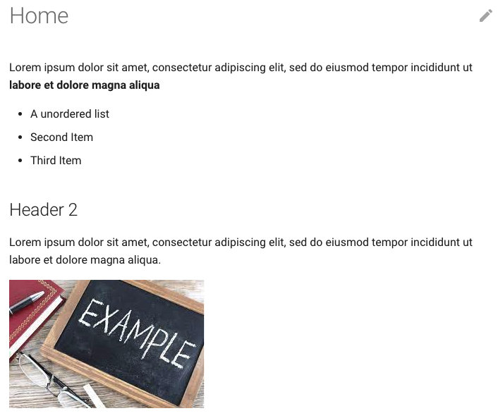

# Documentation

This website was created using [MkDocs](https://www.mkdocs.org/) and [git](https://git-scm.com/). Therefore, writing documentation for the site requires installing both software on one's machine and an understanding of [Markdown](https://www.markdownguide.org/). For advanced users, an understanding of [HTML](https://developer.mozilla.org/en-US/docs/Web/HTML) and [CSS](https://developer.mozilla.org/en-US/docs/Web/CSS) would be beneficial. 

## Software Installation

### MkDocs

MkDocs provides a detailed [installation guide](https://www.mkdocs.org/user-guide/installation/). 

You can check if the installation was successful from the command line with the following command:

```shell
$ mkdocs --version
mkdocs, version 1.2.2 from /usr/local/lib/python3.8/site-packages/mkdocs (Python 3.8)
```

### Git

Download and install the proper [git](https://git-scm.com/downloads) distribution based on your operating system.

You can check if the installation was successful from the command line with the following command:

```shell
$ git --version
git version 2.31.1
```

If this is your first time installing git on your machine, you will also need to configure git to know your GitHub user name and email. From the command line, the commands are: 

```shell
$ git config --global user.name "John Doe"
$ git config --global user.email johndoe@example.com
```

You can check if the configuration was successful from the command line with the following command:

```shell
$ git config --list
...
user.name=John Doe
user.email=johndoe@example.com
...
```

Perform `git clone` to acquire this site's repository and existing files:

```shell
$ git clone https://github.com/UW-CHN/CHN-User-Manual.git
```

This will download the [website's GitHub repository](https://github.com/UW-CHN/CHN-User-Manual) to your current working directory. You will need to run this command only once.


## MkDocs Site Structure

The MkDocs documentation has a helpful [getting started guide](https://www.mkdocs.org/getting-started/?#getting-started-with-mkdocs).

The basic directory structure of a MkDocs site is as follows:

```plaintext
project
├── docs
│   ├── index.md
│   ├── appendix
│   │   ├── site-settings.md
│   │   ├── site-config.md
│   │   └── ...
│   ├── img
│   │   └── ...
│   └── ...
└── mkdocs.yml
```

### `mkdocs.yml`

The `mkdocs.yml` is the configuration file for the site. You can read about all the configuration option in the detailed [user guide](https://www.mkdocs.org/user-guide/configuration/). But for this site's purposes, it will only focus on the `nav` field ([more detailed instructions](https://www.mkdocs.org/user-guide/writing-your-docs/#configure-pages-and-navigation)).

Site navigation is defined in `nav` field. Each page (e.g., `page-1`, `page-2`) are defined at the first level. Each first level page can have subpages (e.g., `subpage-1`, `subpage-2`) defined at the second level. All (sub)pages can be named whatever the user wishes, but if there are special characters (e.g., `:`) the (sub)page name needs to be wrapped in quotes (`"page 1: name"`).

The value of each page name field is the relative path to the markdown file (`.md`). That means that within the `docs` directory, there is a `page-1-markdown.md` that will be rendered as `page-1`. It also follows that `subpage-1` is rendered from the `subpage-1-markdown.md` file located within `docs/subfolder/`.

```yaml
nav: 
    - page-1: page-1-markdown.md
    - page-2: 
        - subpage-1: subfolder/subpage-1-markdown.md
        - subpage-2: subfolder/subpage-2-markdown.md
```

Using the [previously defined directory structure](#mkdocs-site-structure), this would produce a `nav` configuration as such: 

```yaml
nav:
    - HOME: index.md
    - APPENDIX: 
        - Site Settings: appendix/site-settings.md
        - Site Configuration: appendix/site-config.md
```

### Markdown Files

Markdown is a lightweight markup language that is a more flexible than plain text, but not as burdensome as LaTeX. Here is a simple [getting started guide](https://www.markdownguide.org/basic-syntax/) for basic Markdown sytax.

MkDocs compliant Markdown files need to be saved with a `.md` extension and within the `docs` directory. Here is a simple example of what could be in the Home page `index.md`:

```md
# Home

Lorem ipsum dolor sit amet, consectetur adipiscing elit, sed do eiusmod tempor 
incididunt ut **labore et dolore magna aliqua** 

* A unordered list
* Second Item
* Third Item

## Header 2

Lorem ipsum dolor sit amet, consectetur adipiscing elit, sed do eiusmod tempor 
incididunt ut labore et dolore magna aliqua.


```

The above code would produce a page like this: 

<figure class="border">
    
    <figcaption class="margin-1em">
    MkDocs site page rendered from a Markdown file.
    </figcaption>
</figure>

??? example "Advanced: HTML"
    In the case that Markdown is *not* enough for your purposes, inserting raw HTML into the Markdown files is also viable. For example, if you wanted to set the `alt`, `width`, and `height` attributes of an embedded image:

    `#!html `

## Live Site Building

MkDocs allows user to write and edit their Markdown files live by hosting a server in a browser. Once the skeleton of your site has been developed, you can start the server with `mkdocs serve` in the command line: 

```shell
$ mkdocs serve
INFO     -  Building documentation...
INFO     -  Cleaning site directory
INFO     -  Documentation built in 0.07 seconds
INFO     -  [14:56:49] Serving on http://127.0.0.1:8000/
```

Opening the server `http://127.0.0.1:8000/` in your favorite browser will display the site. The server will automatically detect changes you make to the site documents and render them in realtime.

## Commit and Deploy Site

!!! important
    Multiple people could be working on the site at the same time. It is good practice to call [`git pull`](https://www.atlassian.com/git/tutorials/syncing/git-pull) before you start working and commit changes to stay up to date.
    
When you are satisfied with the edits to the site, you need to `git commit` your work. First, you must navigate your through the command line to the project folder. Using the `git` command, you will [`add`](https://www.atlassian.com/git/tutorials/saving-changes) all the relevant files, [`commit`](https://www.atlassian.com/git/tutorials/saving-changes/git-commit) the changes, and [`push`](https://www.atlassian.com/git/tutorials/syncing/git-push) the work to GitHub.

```bash
# Navigate to project directory
cd /path/to/project

# Add one file at a time
git add mkdocs.yml docs/index.md

# Adding mkdocs.yml and all .md files in appendix/ directory
git add mkdocs.yml docs/appendix/*.md

# Commit changes with a message
git commit -m "Editing the appendix pages"

# Push commits to GitHub
git push origin master
```

All work should be committed such that when the command `git status` is ran, you should get the following message.

```shell
$ git status
On branch master
nothing to commit, working tree clean
```

??? info
    This documentation walks through the git `add` and `commit` process assuming all work is completed on the `master` branch. This does **not** need to be the case. If you prefer working on a separate branch and then performing `git merge`, this also a viable option.


The `mkdocs` makes it incredibly easy to [deploy the site](https://www.mkdocs.org/user-guide/deploying-your-docs/) with [GitHub Pages](https://pages.github.com/).

Navigate to the `master` branch and issue the command:

```shell
$ mkdocs gh-deploy
```

And you have successfully update this website!