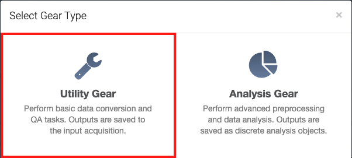

# BIDS Curation

The Brain Imaging Data Structure (BIDS) is a methods of organizing neuroimaging and behavioral data. The BIDS specification has become more widespread as it provides a standard directory structure for complicated neuroimaging data. It also facilitates data sharing across sites and labs.

To read more about the latest BIDS standard, go to the [BIDS Homepage](https://bids.neuroimaging.io/index.html) or the [BIDS Documentation](https://bids-specification.readthedocs.io/en/stable/).

## Data on Flywheel

The raw DICOMs that come off the scanner are automatically uploaded to Flywheel via a [connector](https://docs.flywheel.io/hc/en-us/articles/360016798554) located within the console room. Users are still able to [manually upload](https://docs.flywheel.io/hc/en-us/articles/360008109094) data to Flywheel, but unless it is a small dataset, it is not recommended.

The DICOMs are sorted by [Flywheel's data hierarchy](https://docs.flywheel.io/hc/en-us/articles/4403390307475). The heirachy is organized as follows: 

1. Site - The institution's Flywheel installation 
2. Group - The PI, Lab, or virtual team
3. Project - An experiement or other collection of data 
4. Subject - A research participant / patient, animal, or phantom 
5. Session - A subject's visit or interaction with a modality to perform an evaluation
6. Acquisition - Unit of data collected during a session
7. File - The actual scan files (e.g., .dicom, .nii.gz) underneath an acquistion label

At the scanner console, the naming convention of the Project, Subject, and Session label will be established. For example if the scan was apart of a Project named `ProtocolTests` for Subject `S01` and Session `01`. The data will be show up on Flywheel named and located correspondingly. Commonly, you will be only interacting with the data starting from the Project level and downwards. 

Each acquisition is titled as they are listed on the scanner console. For example, a T1 weighted MPRAGE acquisition may be labeled `anat-T1w_acq-mprage` (according to [ReproIn's](https://github.com/repronim/reproin) naming convention) and will appear as such in Flywheel. The DICOM file(s) associated with the acquisition will be named based on instance UID (e.g., `1.3.12.2.1107.5.2.43.166210.2021060415181758435031308.0.0.0.dicom.zip`). Any processed files will also appear nested under the acquisition label, such as the `dcm2niix` converted `.nii.gz` file show in the figure below. 

<figure class="double-border">
    
    <figcaption class="margin-1em">
    An acqusition label "anat-T1w_acq-mprage" and its dicom and nifti files.
    </figcption>
</figure>

When the DICOM is uploaded, Flywheel will also populate its metadata fields. The metadata can be viewed by clicking on the "Information" icon for a file (or any type of Flywheel data). 

<figure class="double-border">
    
    <figcaption class="margin-1em">
    Example of Flywheel metadata for a DICOM file.
    </figcaption>
</figure>

Exporting data at this stage will result in the a directory structure that follows Flywheel's data heirarchy and the files will retain their UID naming. This is typically not ideal as UID names are not human readable without training. Therefore, it is preferable to use the BIDS Curation gear, which helps rename the data files when you are exporting them from Flywheel. 

## BIDS Curation Gear

The [BIDS Curation Gear](https://gitlab.com/flywheel-io/flywheel-apps/curate-bids) is software developed by Flywheel to help translate Flywheel metadata to BIDS compliant metadata. This allows the data to be downloaded from Flywheel in BIDS standard and allows other softare packages (e.g., [fmriPrep](https://fmriprep.org/en/stable/)) to easily process the data. Flywheel's [BIDS Curation Gear Documentation](https://docs.flywheel.io/hc/en-us/articles/1500006525322-BIDS-Curation-Gear) also provides additional information about the gear.

If you have a Project on Flywheel, navigate to the "Sessions" tab. From here you can check if the BIDS Curation Gear is available for your project by the following steps on Flywheel.

1. **Select the "Run Gear" button.** The button is located under the "Acquisitions" tab in the upper right hand corner.

    <figure class="double-border">
        
    </figure>

2. A pop-up will appear, **select "Utility Gear"**.

    <figure class="double-border">
        
    </figure>

3. In the "Select Gear" dropdown menu, there should be a **"BIDS Curation"** option.

    <figure class="double-border">
        
    </figure>

    If the BIDS Curation Gear does not exist for your project and it should, please contact John Pyles at <johnp@uw.edu>.

## BIDS Template File

The BIDS Curation Gear works because of the [BIDS Template File](https://docs.flywheel.io/hc/en-us/articles/1500006476961-The-BIDS-template-file). The BIDS template file is a JSON file that the BIDS Curation Gear uses to translate Flywheel metadata to BIDS compliant metadata.

To learn more information about the BIDS Curation process and BIDS template, a good introduction would be to watch [Flywheel's BIDS Templating Webinar](https://docs.flywheel.io/hc/en-us/articles/360053720853-Webinar-BIDS-Templating). Further reading of Flywheel's documentation about how the template engine performs its processing is detailed [here](https://docs.flywheel.io/hc/en-us/articles/1500006476941-How-the-BIDS-template-engine-processes-data) and a breakdown of the template file's definitions, rules, and syntax are explained [here](https://docs.flywheel.io/hc/en-us/articles/1500006476961-The-BIDS-template-file).

### CHN ReproIn Extension Template

At CHN, we have a custom BIDS template file, which was an extension of the [ReproIn](https://github.com/repronim/reproin) template, that satisfies the most common acquisitions the center collects. This template file can be downloaded <a href="../../files/chn-reproin-extension-project-template.json" download>here</a>.

Custom template files should be attached as a the Project level file. This can be achieved by going to the Project's "Information" tab. There is an "Attachments" section where files can be uploaded.

<figure class="double-border">
    
    <figcaption class="margin-1em">
    Example of the `chn-reproin-extension-project-template.json` file attached at the Project level.
    </figcaption>
</figure>

## BIDS Curation Process

The BIDs curation process is well documented by Flywheel as a tutorial and is highly recommended that users read it before attempting on their own. Each step below links to the relevant documentation, but this page will attempt to highlight the main points of each stage.

1. [Prepare the data](https://docs.flywheel.io/hc/en-us/articles/1500006508722-BIDS-curation-tutorial-part-1-preparing-data)
    1. Run the [SciTran: DICOM MR Classifier Gear](https://github.com/scitran-apps/dicom-mr-classifier).
    2. Run the [dcm2niix: DICOM to NIfTI conversion Gear](https://github.com/flywheel-apps/dcm2niix)
    3. (*Optional*) Run the [CMRR: Extract CMRR Physio Gear](https://github.com/flywheel-apps/extract-cmrr-physio)

2. [Run the BIDS Curation Gear](https://docs.flywheel.io/hc/en-us/articles/1500012005281-BIDS-curation-tutorial-part-2-running-the-BIDS-Curation-gear)
    1. Run the BIDS Curation gear with desired configurations
    2. Review "Provenance" for curation success or failure
    3. Review BIDS curated acquisitions with "BIDS View"

3. (*Optional, unless curation failed*) [Troubleshooting](https://docs.flywheel.io/hc/en-us/articles/4402385363859-BIDS-curation-tutorial-part-3-troubleshooting-and-debugging)
    1. Identifying a curation failure and read the curation log
    2. Adjust the BIDS Curation template to capture the error, either by:
        1. Modify the template to suit your needs  
        (and consider sharing a successful template fix with the CHN).
        2. Contacting Kelly at for help.
    3. Re-run the BIDS Curation gear

For further support regarding the BIDS curation process, please contact Kelly at <kchang4@uw.edu>.