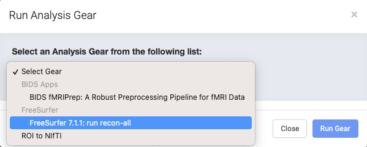
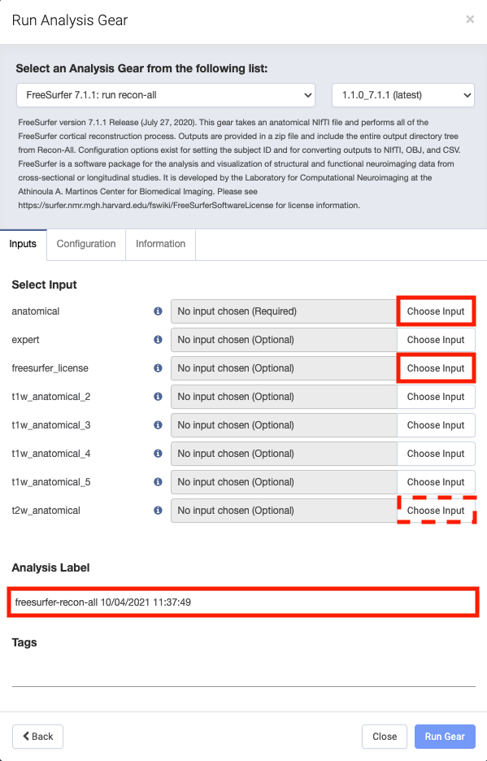
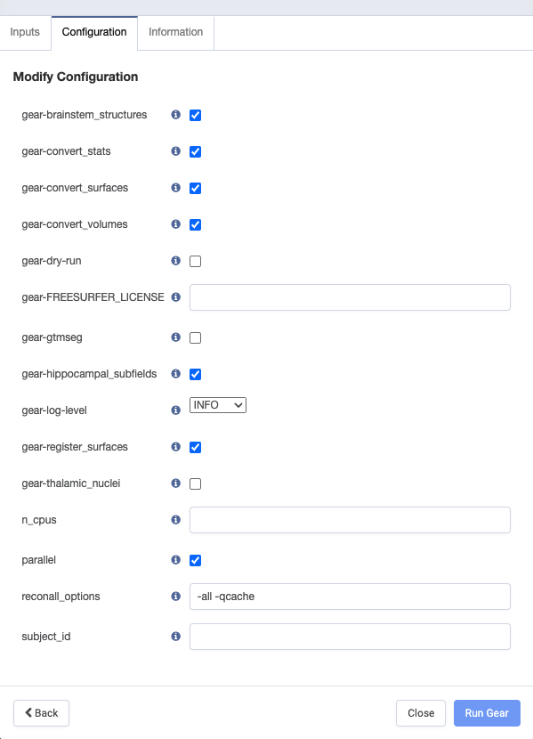
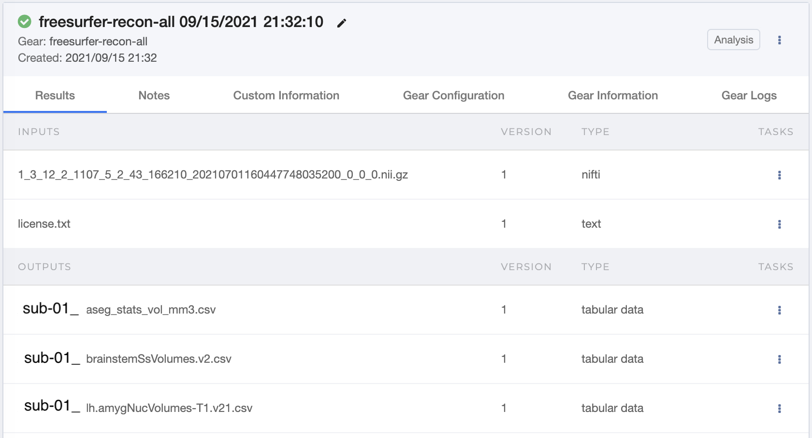
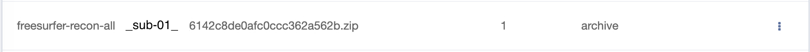

# FreeSurfer `recon-all`

[FreeSurfer](https://surfer.nmr.mgh.harvard.edu/fswiki/FreeSurferWiki) is a software package that analyzes and visualizes structural and functional neuroimaging data. It is a reputable software known for its structural MRI analysis.

FreeSurfer commands are called from the command line, so having some familiarity is recommended. To download and install FreeSurfer onto your preferred local machine, follow their documentation [here](https://surfer.nmr.mgh.harvard.edu/fswiki/DownloadAndInstall).

An important step in the installation process is obtaining a [license key](https://surfer.nmr.mgh.harvard.edu/registration.html). This step is critical because the license key file is required in order to use Freesurfer on Flywheel.

## `recon-all`

[`recon-all`](https://surfer.nmr.mgh.harvard.edu/fswiki/recon-all) is the command that implements FreeSurfer's cortical reconstruction process. The reconstruction process is multi-stepped and the details are explained on FreeSurfer's `recon-all` [process flow](https://surfer.nmr.mgh.harvard.edu/fswiki/ReconAllDevTable) page.

### Common Commands

Users are able to have `recon-all` perform any part of the cortical reconstruction pipeline with additional arguments. But most commonly, users specify `recon-all` to perform *all* parts of the cortical reconstruction.Below are common commands one would use to call `recon-all`.

Command to perform all parts of cortical reconstruction on a T1-weighted image.

```bash
recon-all \
    -s "output_directory_name" \
    -sd "/path/to/output/directory" \
    -i "/path/to/t1/weighted/image/file" \
    -all
```

Command to perform all parts of cortical reconstruction on a T1-weighted image while also [specifying a T2-weighted image to improve pial surfaces](https://surfer.nmr.mgh.harvard.edu/fswiki/recon-all#UsingT2orFLAIRdatatoimprovepialsurfaces).

```bash
recon-all \
    -s "output_directory_name" \
    -sd "/path/to/output/directory" \
    -i "/path/to/t1/weighted/image/file" \
    -T2 "/path/to/t2/weighted/image/file" \
    -T2pial \
    -all
```
## Output of `recon-all`

When `recon-all` finishes processing, the resulting output directory (with a few notable files) is shown in the following diagram:

```plaintext
output_directory
├── label
├── mri
│   ├── brain.mgz
│   ├── orig.mgz
│   └── ...
├── scripts
│   ├── recon-all.log
│   └── ...
├── stats
├── surf
│   ├── ?h.inflated
│   ├── ?h.orig
│   └── ...
├── tmp
├── touch
└── trash
```

## `recon-all` on Flywheel

A good question to ask is why you should run `recon-all` on Flywheel when it can be performed locally? Well, `recon-all` is a notoriously time consuming computational process. It has been documented that processing one subject could take 6 - 24 hours depending on the computer's processor. Whereas, performing `recon-all` through Flywheel would use the (cloud) processors Flywheel is hosted on. This not only potentially speeds up the whole process, but also frees up the computational load from your local machine.

### Run the Gear

Below are the steps to run `recon-all` through Flywheel's gear mechanism.

1. [**Attach your FreeSurfer license file to the Project**](https://docs.flywheel.io/hc/en-us/articles/360013235453). A valid FreeSurfer license *must* be available in order to use the `recon-all` gear.

    <figure class="double-border">
        
    </figure>


2. **Select the "Run Gear" button.** The button is located under the "Acquisitions" tab in the upper right hand corner.

    <figure class="double-border">
        
    </figure>

3. A pop-up will appear, **select "Analysis Gear"**.

    <figure class="double-border">
        
    </figure>

4. In the "Select Gear" dropdown menu, there should be a **"FreeSurfer 7.X.X: run recon-all"** option.

    <figure class="double-border">
        
    </figure>

    If the FreeSurfer `recon-all` gear does not exist for your project and it should, please contact John Pyles at <johnp@uw.edu>.

5. In the "Inputs" tab, **select the "Choose Input"** button for the:
    1. `anatomical`: i.e., T1-weighted image file
    2. `freesurfer_license`: the FreeSurfer `license.txt` file
    3. (*Optional*) `t2w_anatomical`: i.e., T2-weighted image file

    <figure class="double-border">
        
    </figure>

    Also consider re-naming the "Analysis Label" section with additional information beyond the processing start time, such as the T1-weighted image file name.

6. In the **"Configuration" tab**, modify the desired `recon-all` options.

    <figure class="double-border">
        
    </figure>

    !!! tip
        It is highly recommended to use the "parallel" option. This allows `recon-all` to process in parallel, which greatly speeds up the computational processing time. The default is to have the parallel selected, but checking the configuration options is good practice.

7. Select **"Run Gear"** in the bottom right-hand corner and wait > 6 hours.


## `recon-all` Output on Flywheel

Once `recon-all` is finished, the results will appear in the session's "Analyses" tab. Refer to the [Analysis Gear documentation](https://docs.flywheel.io/hc/en-us/articles/360015505453) for images and more details about analysis gears on Flywheel.

Here is an example output from `recon-all`. The image has been truncated and does not show every output file created by the `recon-all` gear. All output files can be downloaded as apart of the entire analysis or individually by selecting the :fontawesome-solid-ellipsis-v: icon.

<figure class="double-border">
    
</figure>

There will be a zip file located within the output files (see below). Unzipping the archived file will produce the usual `recon-all` [output](#output-of-recon-all).

<figure class="double-border">
    
</figure>

## Reconstruction Quality Metrics

There are a few metrics that FreeSurfer is capable of calculating that may be of interest to people attempting to quantitatively assess the reconstruction results.

### Euler Number

The [euler number](https://bookdown.org/u0243256/tbicc/freesurfer.html#euler) describes the topographical complexity of the reconstructed cortical surface. The formula for the euler number is $\mathrm{euler} = 2 - 2g$, where $g$ is the number of holes in the surface. Therefore, the euler number for a flat and smooth surface with no holes ($g = 0$) is 2.

A good surface reconstruction algorithm aims to minimize the number of holes, $g$, in the surface. This means the closer the surface's euler number comes to 2, the better the reconstruction, which implies better data quality (see [Rosen et al., 2018](https://doi.org/10.1016/j.neuroimage.2017.12.059)).

The following command can be called from the command line to find the euler number and number of holes for each hemisphere:

```shell
$ grep -A2 "Computing euler" "/path/to/.../scripts/recon-all.log"
Computing euler number
orig.nofix lheno =  -20, rheno = -34
orig.nofix lhholes =   11, rhholes = 18
```

### Contrast-to-Noise Ratios

Contrast-to-noise ratio (CNR) is the difference in signal intensities between regions classified as different tissues types vs. the background (noise). Therefore, the greater the CNR value, the greater the contrast (and algorithmic separability) between the two tissues types.

FreeSurfer calculates the gray/white matter and gray matter/cerebral spinal fluid (CSF) CNR values for each hemisphere with the `mri_cnr` command.

```shell
$ mri_cnr "/path/to/.../surf" "path/to/.../mri/norm.mgz"
processing MRI volume /.../freesurfer/7.X.X/.../mri/norm.mgz...
	white = 96.8+-6.1, gray = 76.0+-13.6, csf = 56.0+-16.6
	gray/white CNR = 1.921, gray/csf CNR = 0.871
lh CNR = 1.396
	white = 96.7+-6.3, gray = 76.4+-13.4, csf = 56.3+-16.2
	gray/white CNR = 1.880, gray/csf CNR = 0.905
rh CNR = 1.392
total CNR = 1.394
```

Each hemisphere's CNR value is the average of the hemisphere's gray/white and gray/CSF CNR values, and the total CNR value is the average of the two hemisphere's CNR values.

For comparisons of CNR values, see [Chalavi et al. (2012)]( https://doi.org/10.1186/1471-2342-12-27).