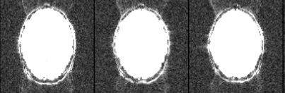
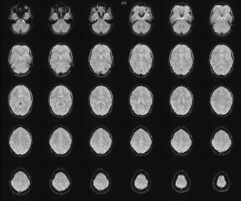
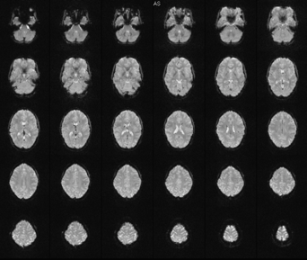

# EPI: Artifacts

## I hear a lot about ghosting when people talk about EPI. What is a ghost and what causes them? How do I get rid of them?

The EPI pulse sequence is a train of gradient echoes, each echo encoding a piece of the second image dimension, the phase-encoded dimension. But before the spatial images (the images you are used to looking at) can be constructed with a 2D Fourier transform, the even-numbered echoes must first be time-reversed. In effect, time travels forwards for the odd-numbered echoes but backwards for the even-numbered echoes, so one must be made consistent with the other before we can apply the 2D FT.

This is a relatively trivial processing step. However, there is a catch. While we might consider the data sampling of the even-numbered echoes to be running backwards in time, the data points are actually collected with time running forwards (of course); the fact that the data points themselves are being collected in reverse is neither here nor there for the physics of the situation.

Imagine there is a simple delay at the very start of the gradient echo train. From the standpoint of the data in the echo train, this looks like a delay at the start of the sampling period for the odd echoes but a delay at the end of the sampling period for the even echoes! This causes the delay to manifest itself in a zigzag manner across the entire set of gradient echoes. The zigzag delay causes a different phase for the odd and even echoes - the phase zigzags in proportion to the delay – and when we then apply the 2D FT that phase zigzag creates an ambiguity in the spatial position of the brain signal. In fact, the ambiguity is at exactly half the field-of-view. For this reason these ghosts are often called N/2 ghosts, where N refers to the field-of-view. The bigger the delay, the bigger the phase zigzag, the bigger the ambiguity, the more the signal is deposited at the half field-of-view position instead of the correct spatial position.

Below is an example of three EPI slices, contrasted to show the ghosts:

<figure>
    
</figure>

It was necessary to increase the background intensity to visualize the ghosts. That is typical for a well-shimmed, low ghost EPI. As a rough rule of thumb – and given that it is difficult to quantify by inspection – the ghost level should be 5% or less than the intensity of the brain signal.

What are some physical causes of the phase zigzags that lead to N/2 ghosts? In short, any physical effect that causes a temporal mismatch of the data sampling periods (i.e. when the analog-to-digital converter is turned on) and the readout gradient waveform will lead to ghosts. Another way to think of this mismatch is as any effect that causes the data sampling not to happen where it is supposed to, which is centered on the flat portions of the alternating positive and negative flat periods of the readout gradient echo train. Here are the big offenders:

1. Delays in the MRI signal through to the receiver electronics stages.  Delays induced by analog filtering will appear at the start of sampling periods for positive read gradient episodes, but, following time reversal, at the end of sampling periods for negative read gradient episodes.

2. Short-time scale eddy currents.  These cause an imbalance in the multiple gradient echo train, such that the eddy currents add or subtract to the gradient waveform and cause either early or late refocusing in an alternating fashion through the echo train.

3. Poor center-frequency adjustment (global or regional). Can include frequency drift with gradient heating.  Anything that causes the frequency-encoded readout to be slightly off-resonance will be equivalent to an alternating phase shift imposed on alternating echoes in the train, directly causing ghosts. (Recall that in non-EPI imaging, if you acquire off-resonance this is equivalent to a shift in the frequency-encoded axis. If the off-resonance shift is sufficiently large the image will start to alias in the frequency-encode axis (assuming no filtering to clean it up!). Thus you can recognize the ghosting as an aliasing-like artifact.)

4. In-plane rotation of the field-of-view.  Each physical gradient (Gx, Gy or Gz) has a slightly different electrical inductance and thus has a different response rate to being switched on/off. When the readout gradient is pure Gx, Gy or Gz there is no problem; we are attempting to switch one gradient coil on and off, its response characteristics are constant. But if the readout/phase-encode axes are “mixed” in the magnet reference frame by an in-plane rotation, now there will be, for example, some Gy plus some Gx in the readout gradient vector (Gr in the image reference frame). This leads to a difference in the rate at which one component of Gr comes on compared to the other component.

5. Mechanical resonances.  These manifest in a similar fashion to eddy currents, causing an imbalance in the gradient waveform such that echoes may occur early then late, or late then early, in an alternating fashion throughout the echo train.

Reviewing the list above, it should be clear that you can control (3), (4) and (5) to a considerable extent by shimming/on-resonance adjustment, by avoiding rotated image planes and by avoiding mechanically resonant echo spacings, respectively. A bad shim (e.g. because the subject’s head isn’t straight in the magnet), rotating your image plane or using mechanically resonant echo spacing will all lead to higher than necessary ghosts. Note, however, that sources (1) and (2) are largely beyond our control and are features of the scanner that have been refined by Siemens for decent EPI performance.

Residual ghosts can be corrected to a certain extent by applying phase corrections to the data. On the Siemens scanner this is achieved by acquisition of three gradient echoes immediately after the excitation RF pulse and before the EPI readout echo train starts. These additional “reference” or “navigator” echoes are used to assess the mismatch between the positive and negative gradient data in the absence of phase encoding, and allow a phase correction to be applied to the raw data prior to 2D FT so that the zigzag phase difference is minimized between alternating k-space lines. You don’t need to do anything to have this correction step applied; it is done automatically (indeed can’t be turned off!). However, you do want the correction step to have the minimum work to do, so you should always pay close attention to accidentally introducing new ghost sources, such as (3)-(5) above.

## On the Contrast tab I notice that fat suppression is enabled for EPI. What does it do?

While water constitutes some 60% of total human body mass, and is thus the largest source of hydrogen atoms (protons) giving MR signal, fat is the second-largest source of protons. We have several percent of our total mass as fat. And, unfortunately for fMRI experiments, some of it is present around the head, in the scalp. Not only that but the fat (or lipid, if you prefer) in the scalp is, on a molecular level, quite mobile, behaving almost as if it is a jelly or a viscous liquid rather than something solid, like bone. And that means it will have an intense MR signal.

In the previous section you learnt that one of the sources of N/2 ghosts is off-resonant signal. So if we have an abundant source of hydrogen – fat is primarily long chains of CH2 groups – and if, because of a chemical structure that differs considerably from that of water, those hydrogen nuclei happen to have a different resonant frequency than the (dominant) water signal, then we have an immediate problem: we can’t have both the water and the fat protons be on-resonance at the same time! One of them – the fat, because it’s the smaller of the two – must by necessity be allowed to be off-resonance. Hence, the fat signal will cause ghosts, just like badly shimmed water signal (even though the physical source is very different). Indeed, the frequency shift of fat is usually greater than badly shimmed water! At 3 T, water and fat protons resonate some 430 Hz apart. When you consider that your typical EPI bandwidth is something like 30 Hz/pixel in the phase encoding dimension, you can quickly see that fat signals are going to produce big problems.

What to do? Unlike badly shimmed water signal, there is no way to place the fat on-resonance if the water is already on-resonance. Therefore, we need to get rid of the fat signal. This is fair enough because the signal from scalp fat isn’t valuable to us; we aren’t expecting to localize activations to it (I hope). In other words, if we can manage to eliminate the fat signal then we will eliminate this particular source of ghosts, too.

There are a few different ways to eliminate fat signals. For fMRI, the two most common methods are to simply avoid exciting fat in the first place, via some sort of ‘spectral-spatial’ RF pulse that excites the water in the slice but fails to excite the fat, or to ‘pre-saturate’ the fat resonances just before the slice-selective excitation RF pulse is applied. Both of these approaches are designed to produce no fat signal at the time of the EPI readout train, and of course there are pros and cons to both of them. On our scanner, pre-saturation is the preferred method. This is primarily because the slice profile is generally better (i.e. squarer) and can be made narrower (thinner slices) for fat pre-saturation than for the spectral-spatial RF pulses designed to avoid fat excitation. The penalty for performing the suppression of fat and the excitation of the slice as separate events is a few milliseconds per slice of timing overhead, thereby reducing the spatial coverage in the slice direction a little bit.

For all EPI sequences on our scanner, the parameter “Fat suppr.” on the Contrast tab should be set to Fat sat., for fat pre-saturation. You should not disable fat sat (set it to ‘none’) or switch to the spatial-spectral excitation pulse (‘Water excit. normal’ option) unless you fully understand what you’re doing. Disabling fat suppression entirely will lead to very intense ghosts from subcutaneous lipid, while switching to the spatial-spectral pulse will generate slice thicknesses that have not been verified as matching the nominal slice thickness shown on the screen. (Tests of the spatial-spectral option are ongoing. There may be several other problems with Water excit. normal. Bottom line: don’t use it!)

So that’s subcutaneous fat dealt with. The astute among you might be wondering something: if subcutaneous lipid is such a problem, why doesn’t the white matter in the brain produce ghosts for the same physical reasons? White matter contains a lot of long-chain fatty compounds such as myelin, after all. Are these not also sources of problem CH2 signals? Luckily for us, whilst these compounds are indeed sources of abundant CH2-containing lipid molecules, these molecules are generally too tightly bound to produce very much MR signal. They are more solid-like than the jelly-like composition of scalp fat. In conventional anatomical as well as EPI scans, almost all the signal that we can get from white matter arises from the cellular water. Only a minuscule amount comes from fatty compounds, and we can safely ignore its effect on EPI.

## What is the origin of signal dropout in EPI? Can it be fixed?

Signal dropout is another problem caused by magnetic susceptibility. Recall that because air, bone, tissue, etc. all interact with an applied magnetic field in different ways, severe and spatially complex magnetic field gradients are established across the boundaries between different substances. The spatial characteristics and magnitude of the gradients will depend on the composition as well as the geometry of the sample, and on the orientation of the sample to the applied magnetic field. The inferior portions of the brain and the frontal and temporal lobes are especially badly affected by susceptibility gradients because of the particular geometry of air-filled cavities and the cranium near these brain regions.

So why does the signal disappear in some parts of the brain? The simplest conceptual answer to this question is to consider the phase of the signal across an individual image voxel. The thickness of the voxel in the slice direction is obviously the slice thickness. Let’s say the slice thickness is 4 mm. Now, we know that because of the background susceptibility gradients mentioned above the signal in the voxel is dephased in the time from the RF pulse, which generates the initial magnetization (i.e. the signal), to the time the signal is detected at the echo time, TE. The longer TE the more dephasing happens and the more signal is lost. Why is that? Well, if you think about the destructive interference caused by two signals that have the same magnitude but have opposing phase you can see how, as dephasing occurs, more and more parts of the signal across the voxel will cancel each other out. Once the phase dispersion across the voxel is random, the magnetization that was coherent at TE=0 (immediately after the RF excitation pulse) is now totally incoherent, and there is no net signal. We have signal ‘dropout.’

There are also in-plane mechanisms that can lead to signal dropout; essentially, the magnetic susceptibility gradients interfere with the applied (imaging) gradients and cause the local k-space trajectory to differ significantly from that intended by the imaging gradients alone. If the susceptibility gradients cause the local signal to refocus early or late relative to the multi-echo data readout then we will “miss” that signal in our sampling window.

So, given the problem, what are the potential remedies? In essence there are four simple tactics available as standard on the Siemens Trio. These involve shimming, slice orientation, voxel resolution and echo time (TE). Of these, shimming is the preferred approach, as far as possible, because it gets at the root cause of the problem: it attempts to reduce the spatially complex susceptibility gradients so that the magnetic field becomes homogeneous across the entire head. If we can reduce the susceptibility gradients that cause dephasing in the first place, we can reduce the signal loss. But there are inherent limitations to shimming, not least of which is that the shim coil currents cannot usually be made large enough, or impart sufficient opposing spatial complexity, to offset the gradients established in the head at all locations simultaneously. We can fix 90% of the brain’s signals at the expense of doing a less-than-perfect job in the frontal and temporal lobes, for instance.

Having done as well as we can with the Siemens field map shimming routine, what else can we do? The direction of the slice makes a difference because the susceptibility gradients tend not to be isotropic. It turns out that through-plane dephasing is usually worst for axial slices. Sagittal slices tend to preserve more frontal and temporal lobe signal than axial slices, and coronal slices even more signal than sagittal slices. Of course, it isn’t always possible to use sagittal or coronal slices for a particular experiment, either for spatial coverage reasons or some other sampling consideration.

What else? Increasing voxel resolution – making voxels smaller – tends to reduce the dephasing effects, leading to some recovery of signal. An easy way to increase resolution is to use thinner slices. If a 4 mm thick slice is split into two 2 mm slices we can expect to reduce the phase evolution across the thinner slices and recover some signal that would have been lost in a single 4 mm slice. In magnitude mode, therefore, the addition of two 2 mm slices together would net more signal than a single 4 mm slice, all other parameters being equal. But again, there are limits to how many thin slices you can acquire in a particular TR.

The final way to reduce dropout is to use a shorter TE. You saw in an earlier section how different brain regions require different TE for optimal functional contrast, because T2* varies across the brain. Well, the susceptibility gradients contribute significantly to the local T2*, so it should come as no surprise to learn that those regions of the brain requiring a shorter TE for optimal functional contrast are also the ones that will exhibit most dropout. If we reduce TE we reduce the dephasing and hence reduce the signal loss. Thus, for robust inferior frontal lobe coverage in axial slices, it may be necessary to use a TE as low as 18 ms.

In the figure below you can see the effect of decreasing TE on the degree of signal dropout, as well as on overall image SNR, in a comparison of TE = 20 ms and TE = 36 ms. The frontal and temporal lobe signals are considerably lower in the latter image when compared to parietal and occipital lobes. Also note how much weaker the subcutaneous lipid in the scalp shows up at TE = 36 ms, because the presence of the skull immediately beneath, and air around the head, causes a strong susceptibility gradient across the scalp, leading to a relatively short T2* for the scalp fat. (The scalp fat T2 is actually very much longer than brain tissue T2, so the dark scalp fat signal would be a surprising observation if we didn’t understand the effects of susceptibility gradients causing short T2*.)

<figure>
    
    <figcaption class="margin-1em">TE = 20 ms</figcaption>
</figure>

<figure>
    
    <figcaption class="margin-1em">TE = 36 ms</figcaption>
</figure>

## What is the origin of distortion in EPI? Can it be fixed?

To understand why EPIs are distorted it is instructive to reconsider what makes the pulse sequence useful for fMRI in the first place: its speed. Recall that EPI is a repeated (multi-echo) gradient echo sequence, where a train of gradient echoes recycles magnetization many times, each time acquiring another line of 2D spatial information. (EPI was the original “green” pulse sequence!) For convenience of labeling, let’s say we want to acquire an echo planar image that has a spatial matrix of 64x32 voxels in the plane. Here, the first dimension – 64 points – is the read axis, or frequency-encoded axis, and the second dimension – 32 points – is the phase-encoded axis. As the gradient echo train proceeds through the 32 echoes required to fully encode the 2nd image dimension, 64 frequency-encoded data points are read out during each individual echo.

Now let’s put some timings on the scenario. Let’s say that to acquire 64 frequency-encoded data points takes 0.5 ms. It will thus take 32 times 0.5 ms to complete all the echoes in the train, i.e. the entire 2D plane takes 16 ms to acquire in total.

Of course, from the perspective of covering anatomy this is fantastic! We’ve got an entire 2D image in 16 ms! But there is a penalty. While we are busily switching the gradients back and forth in our multiple gradient echo sequence, encoding the necessary spatial information into the signal, the signal is exposed to contamination from gradients in the sample that we can’t control. These are the infamous ‘susceptibility gradients’ that caused signal dropout in the previous section (and were one source of ghosts in the section before that). Now, however, we are principally concerned with that spatial component of the susceptibility gradients that acts in the same direction as the phase encode dimension of our EPI. In MRI, a gradient is a gradient is a gradient! Magnetization doesn’t care whether we turned the gradient on with the scanner, or whether a gradient was present anyway by virtue of the physical properties of the subject’s head in the magnet; the dephasing effects are the same! Which means that while the gradients we control – the scanner gradients - are imparting their spatial effect on the signal, the background susceptibility gradients are “contributing” too!

Now, it should come as no surprise – especially after seeing the effects of TE on signal dropout in the previous section – that the longer we take in encoding our spatial information, the more contaminated the signal will become. What is more, different parts of the brain experience different susceptibility gradients, so some parts of the brain will have higher contamination levels than others. Unsurprisingly, the frontal and temporal lobes, especially the inferior aspects, are the worst off. Areas that suffer from dropout are also likely to suffer the most from distortion.

How much distortion happens? Well, the conceptual answer is that it depends on the length of the echo train and the magnitude of the susceptibility gradients (in the phase encode dimension). An EPI echo train that lasts for 20 ms might experience a distortion that is less than a millimeter for signal in the occipital lobe, for example. In the frontal lobe the same 20 ms echo train might experience a distortion of several voxels: 6-10 mm or more!

As already described for the issue of dropout, we have limited scope to shim the entire brain to the magnetic field homogeneity we might like. That leaves us with two other approaches. The first is to reduce the problem at source by reducing the duration of the echo train. Reducing the spatial resolution in the phase encoding dimension achieves a shorter echo train, as do parallel imaging methods such as GRAPPA. (GRAPPA is described in later sections.) Another approach is to try to fix the distortion with a post-processing step using a map of the susceptibility gradients; a so-called (magnetic) field map. (See below.) A formula that relates the spatial distribution of the magnetic field to the distorted EPI can then be applied on a voxelwise basis and provide an “undistorted” EPI. However, there are several limitations with this field mapping approach, such as: (i) signals that are distorted and end up overlapped in the original EPI cannot be repositioned separately; (ii) regions of space with poor signal coverage in the field map image are not well supported and this can lead to errors with the algorithm; (iii) head motion between the field map and the EPI to be undistorted will lead to a mismatch and erroneous “corrections.” For these reasons, the application of field maps to raw EPIs or to statistical parametric maps after processing isn’t as common as you might think. Indeed, most studies – even group studies – tend to simply accept the 1D spatial distortion and do as well as possible realigning the distorted EPIs to distortion-free 3D anatomical templates.

The amount of distortion that can be tolerated, and whether or not to acquire field maps, is generally a matter for an individual study. When you are establishing a new protocol for a new study, go talk to Ben or Daniel about distortion and related issues (dropout, TE, GRAPPA, etc.) and decide on the best compromise for your needs.

## What is a field map and how does it fix EPI distortion?

One way to try to undo the effects of distortion in the phase encoding dimension is to measure the susceptibility gradients that produce it, and compute a fix. It’s a simple idea with practical complications. The essential idea is to acquire a map of the magnetic field – a field map – across the brain using a distortion-free pulse sequence - a standard spin warp phase-encoded gradient echo (GRE) sequence is normally used - with the same spatial parameters as the EPI you want to fix. Thus, you establish the same slice prescription, slice thickness, gap and in-plane resolution as used in your EPI, and acquire a pair of GRE images that differ only in their TE. The TE difference is set to allow phase evolution  - the same dephasing that causes the distortion – between zero (perfectly homogeneous magnetic field) and 360 degrees. (I won’t get into the issues of phase unwrapping here. Suffice it to say that it’s important not to allow mod(360) ‘bounce’ points, or the entire process gets more complicated. It’s not something you usually have to worry about in practice. The TE difference has been set up suitably for use at 3 T in brain.)

The difference of the phases acquired by the pair of GRE images is proportional to the TE difference and the underlying magnetic field. The distortion in the phase encoding dimension of your EPI is proportional to the echo spacing and the underlying magnetic field. Thus, a simple equation can relate the phase at a point in undistorted space to the expected distortion, i.e. the displacement of signal that should be at position y in undistorted space, to its position yd in distorted space, i.e. in the EPI. This introduces the first complexity into the distortion correction process. The equation relating y to yd applies only if there is a unique solution for all pixels. It assumes the distortion process, and hence the undistortion, is linear. But if the susceptibility gradients cause signal from multiple undistorted positions to coalesce in the distorted space (in the EPI) then there is no way to correctly reassign the signal at yd back to the multiple correct y locations. For this reason, the preference is to get as much distortion to be a stretch in the EPI, and as little as possible distortion to be compression (where undistorted pixels have, by definition, coalesced). We do this via selection of the phase encoding gradient sign, e.g. anterior-posterior phase encoding is preferred over posterior-anterior phase encoding for axial slices. Even with stretching being the predominant distortion type, however, there will be regions of brain for which the undistortion algorithm is incorrect, and some pixels will remain misplaced in the “corrected” image.

The next experimental complexity arises when you consider the separate acquisition of the field map from the EPIs you want to fix. What if the subject has moved? Clearly, motion will cause some degree of mismatch between the field map and some or all of the EPIs in a time series. The assumption in the correction method is that signals in the GRE images provide mathematical support (signal, in other words) for all regions of space that can be (and have been) distorted in the corresponding EPIs. Motion will very likely challenge that assumption. How much? It depends, of course. But if you are sufficiently bothered by distortion in EPIs to want to try to correct it with a field map, then a good general rule is to acquire one field map per block of EPI, unless your EPI blocks are very short (2-3 minutes each) in which case one field map every two or three blocks probably suffices. But, as indicated, the appropriateness of the field map is dependent on the amount your subject moves within and between EPI blocks.

## I want to try to fix my distortion with a field map. What do I need to acquire?

You first need to add a suitable acquisition to your protocol. In the Exam Explorer, copy-paste the gre_field_mapping sequence from:

    SIEMENS > advanced applications libraries > bold imaging

into your protocol, then change all the spatial parameters of your copy of the gre_field_mapping sequence to match those of the EPI scan that you intend to undistort. The spatial parameters are the slice prescription, in-plane resolution (i.e. the field-of-view and matrix size), number of slices, slice thickness and slice gap. (If your protocol uses two or more different EPI parameter sets, e.g. one slice thickness for a task-based experiment and a different one for resting state, then you need a separate field map for each.) However, you don’t need to set up the gre_field_mapping sequence to use GRAPPA or partial Fourier should your EPI scan use one or both of these options. Contact Ben if you are unsure of how to match parameters.

Unlike for EPI, it actually doesn’t matter whether you use interleaved or descending slices, so feel free to leave the multi-slice mode set at Interleaved. All timing parameters, including the TE and TR, can be left at their default values as well, unless the scanner tells you that it must increase TR to fit the number of slices you’re requesting, in which case accept the TR the scanner computes.

Save the spatially matched field map sequence in with your protocol. During your experiment, when you are ready to acquire the field map data, ensure that the slice prescription for the field map sequence matches that for your EPI, by using either AutoAlign or by copying the slice prescription parameter directly from the EPI to the target field map sequence. If you’re using AAHScout, ensure that the AutoAlign parameter (on the Routine tab) is set to Head > Brain mode on the gre_field_mapping scan, exactly as you use for EPI. Depending on the spatial resolution requested, each field map will take about a minute to acquire. Larger matrix sizes will take longer. Re-acquire the field map whenever your EPI spatial parameters change, whenever you suspect the subject has moved (such that the field map is unlikely to match the EPIs you want to correct), and whenever there’s an idle moment in your protocol.

*Using the field map data:*

The gre_field_mapping sequence acquires two GRE images that differ in their TE; this is already set up for you. At the end of the acquisition the Siemens software automatically computes a phase map from the difference of the two TE images. Thus, on the database you will find one raw data set of 2N slices (two TEs for N slices) and one phase map with N slices, where N is the number of slices requested. The phase map data is what you need to take offline with your EPI to compute the distortion correction using, for example, the FSL routine, FUGUE or the Fieldmap Toolbox in SPM.

As mentioned in the previous section, exactly when and how you acquire field maps is a matter of experimental preference. You definitely need separate field maps if you acquire two or more different EPI protocols, e.g. you use one set of parameters for a localizer task and a different, higher resolution set, say, for the rest of your experiment. Another common situation is to use axial slices for one part of an experiment and oblique slices for another. You need separate field maps for each. Essentially, any time you can expect a spatial mismatch between the field map and the EPI, you need a new field map. This can arise as just mentioned, because of intentional parameter changes, or because of subject motion.

## Whoa! I’m watching my EPIs on the Inline Display window and I’m seeing all sorts of weirdness. What’s going wrong?

Motion is the biggest obstacle between you and a successful fMRI experiment! Whenever EPIs don’t appear as you’d expect, the initial suspicion should be subject motion. But it’s not the only source of artifacts in EPIs, nor is there just a single way in which motion can render your EPIs less than perfect. Here are the major artifact sources and suggested remedial steps to fix them:

***Nodding motion.*** A change in the chin-to-chest direction might be caused by your subject fidgeting, craning to see the visual display, coughing, swallowing, talking, reaching to scratch his knee, or a sympathetic head motion in concert with a button push on a response box. How the motion appears in your images will depend significantly on your slice direction. If you are using axial or near-axial slices you may notice significant change in the anatomical content of a particular slice from volume to volume, especially towards the top of the head where there is very little signal in the image and a small shift will add or subtract a relatively large amount of signal. Note also the fluctuations in the intensity of N/2 ghosts across the images, resulting from temporary degradation of the magnetic field homogeneity whenever the head is displaced from the position it was in during the shim.

If you are seeing something like this, try running a short test EPI of say thirty volumes (having disabled your script so that it doesn’t run by accident!) and ask the subject some questions, or to cough or swallow, etc. and see what happens in the Inline Display window when you know motion is definitely present. Look like your earlier problem? Then go in and repack the subject’s head, or add some additional restraint. Don’t be tempted to just “coach” your subject into moving less. You want good head restraint AND a cooperative subject so that if and when the subject moves involuntarily the distance he can move is minimal.

***Side-to-side motion.*** This sort of motion is rare, unless you have failed to add any padding to the sides of your subject’s head, or your task involves making saccades to extreme left/right targets, or if you have fidgety kids or other subjects who find it difficult to lie still for any length of time, no matter what you tell them. If you are using axial or near-axial slices, this motion appears as an obvious in-plane rotation or translation left-to-right of the anatomical signal. The ghost level may also fluctuate in concert with the rotation or translation.

If you suspect side-to-side motion and think you can reduce it, simply add an extra piece or two of foam padding to one or both sides of the subject’s head. Don’t squeeze the subject in so that they are uncomfortable - especially if they are wearing headphones that can dig into the sides of their head if they are too tight - but do make sure they are in snugly. Ask the subject to try shaking his head side-to-side and see how much capacity for movement remains. It should be difficult for the subject to twist more than a few millimeters left or right, and they should always return to a symmetric, centered position when they relax.

Another strategy to deal with motion concerns subject comfort. Uncomfortable subjects move more. Start off by ensuring the subject is comfortable, with the knee support, a blanket, etc. Then inform the subject that if he needs to stretch his lower back or scratch his nose or move his feet, he should do so only when the scanner is silent. Let the subject know that movement of any part of his body – even his feet or his arms – is likely to move his head via his skeleton. You can’t prevent a subject, even a comfortable one, from moving entirely. Instead, try to ensure all movements happen between runs so there’s less need for a subject to move during a run. Ask the subject to let you know if/when he needs to stretch or scratch so that you are in a position to decide whether you might need to re-shim or check slice positions.

Finally, too much head packing can be uncomfortable, too. Jamming excessive foam between the headphones and the RF coil is liable to leave circular imprints on the sides of your subject’s head. You shouldn’t be surprised if the subject asks to bail on the scan early because his ears hurt, or he starts trying to relieve the pressure points by moving during the scan.

## How much subject movement is too much?

Oh, if only there were a simple answer to this age-old question! At the end of the day, only the results of a full analysis can determine whether your subject moved “too much.” As a rough rule of thumb, though, users report that rigid body realignment numbers of less than 2 mm of movement in any one axis over the duration of a time series (say 200 EPI volumes) is normally acceptable for getting activations that make sense, and without too many false positives. The more you scan and the more data you analyze, the more likely you are to be able to tighten this criterion and perhaps add your own empirical assessment that you can use during a scan session (where you have a chance to fix the problem). Most often this means watching the Inline Display closely for glaring examples of subject motion: yawning, nose scratching, head movement coincident with respiration because you didn’t pack the head very well, etc. If you can see the head moving the chances are you’ll get more than 2 mm overall movement.