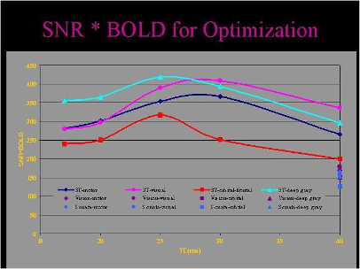

# EPI: Basic Parameter and Sequence Issues

## I’ve been told not to use echo spacing between 0.6 and 0.8 ms for EPI. How come?

The gradient set has mechanical resonances that produce disproportionately larger vibration, and thus EPI ghosts, when the echo spacing is in the range 0.6-0.8 ms for axial or axial-oblique slices. Therefore, to assure good, clean EPI performance, you should operate outside this range of echo spacing. (There are additional mechanical resonances at very short echo spacing – generally below 0.45 ms – but these are at the highest end of gradient performance and aren’t as likely to impact fMRI protocols with typical spatial resolution. If you are pushing gradient performance for high spatial resolution, talk to Ben about avoiding problems at very short echo spacing.)

First of all, why should echo spacing be of concern at all? Recall that EPI is a multiple echo, gradient-echo sequence; that is, it is a periodic gradient-recalled echo sequence whose echoes happen at a particular frequency. If the EPI matrix is 64x64, then 64 readout points are acquired for each of 64 echoes, making the echo train length 64. The echo spacing is the time it takes between each of these echoes, i.e. how long it takes to acquire the 64 readout points, plus a little bit of overhead. It just so happens that if the echo spacing is set to be certain values, the forces induced in the gradient set can resonate mechanically, just like an old washing machine on the spin cycle.

But, all is not lost! For a start, we know the echo spacing values that generate the mechanical resonance effects, so we can work around them. When using axial or axial-oblique slices the readout image axis uses the X gradient. (X is the gradient oriented left-right as you look at the front of the magnet.) It turns out that the X gradient has the largest mechanical resonance. The mechanical problems (and the concomitant ghost levels) are highest when using echo spacing of between 0.6-0.8 ms. (The worst performance is attained at 0.69 ms.) Outside of these values you won’t see unnecessarily large ghosts.

There is even better news for coronal and sagittal slices. Here, the X gradient isn’t used for readout so the mechanical resonance effects are much reduced. In fact, only the very shortest echo spacing of 0.43-5 ms cause significantly higher ghosts. The ghost level is persistently low above 0.5 ms echo spacing.

As far as the mechanical resonance is concerned, as a general rule it doesn’t matter what your nominal matrix size is (say 64x64, or 96x96) or whether you have GRAPPA turned on or not. All that matters is whether the forces being generated by the switching gradients are happening at a frequency corresponding to the mechanically resonant frequency of the gradient set. Instead, slice prescription (which sets the readout gradient direction in addition to the slice axis, of course) and the echo spacing parameter are the primary concerns.

In general, setting the echo spacing isn’t something you should be setting yourself unless you have fairly expert training. Call me for assistance. (The particular echo spacing in your EPI acquisition will usually be determined by the resolution you want, along with consideration of the mechanical resonances.) In any case, once you have a fixed protocol, echo spacing isn’t something you will have to worry about. But if you are stealing someone else’s protocol (not advised!) and don’t want any help from me, you may check for yourself the echo spacing on the Sequence tab of the parameters task card for your EPI acquisition. You’ll see Echo spacing in the bottom-right corner of that card. You want to see a value of 0.6 ms or less, or 0.8 ms or more. If you see a number between 0.6 and 0.8 ms it’s time to break down and call me.

## How many dummy scans happen before the first real (saved) volume of EPI in my time series?

If you are using the ep2d_neuro sequence you can specify the number of dummy scans (above a minimum default). If you are using one of the Siemens EPI variants (described later on) then the number of dummy scans is computed for you.

For the Siemens EPI sequences (ep2d_bold, ep2d_pace), here’s the formula for the default number of dummy scans (or the minimum if you are using ep2d_neuro). You always get at least one dummy scan - call it a freebie, or a dummy scan for good luck. Next, divide your TR into a reference time of three seconds. For example, a TR of 1.5 seconds goes twice, a TR of two seconds goes once. Ignore any remainder. So with a TR of 1.5 seconds there would be 1 (freebie) + 2 = 3 dummy scans total. For a TR of 2 seconds there would only be 1 + 1 = 2 dummy scans total.

There is no way to control the number of dummy scans independent of TR. It’s always computed for you and fixed (with the exception of ep2d_neuro, when additional dummy scans can be added above the default/minimum).

Note that if you are using a parallel imaging method, such as GRAPPA, the auto-calibrating signal (ACS) scans will occur immediately after the dummy scans and before the first real (saved) volume of data in your time series. So if you are using one of the Siemens EPI variants, you’ve asked for 200 volumes with a TR of 2 seconds, and a GRAPPA-factor of 2 then there will be two dummy scans (computed as above) followed by a single ACS scan. After this you acquire the first volume of your two hundred volumes. The overall scan duration, then, is 203 volumes x 2 sec = 406 seconds. If you are using the ep2d_neuro sequence (see description of the ep2d_neuro sequence in this FAQ) then there will be the chosen number of dummy scans followed by two ACS scans and your two hundred volumes.

## I want 200 volumes in my EPI time series. How do I do that?

On the Exam task card (the main environment where you drive the scanner), select the BOLD tab on the parameter window. The number of volumes is specified by the rather cryptic parameter called Measurements. Just enter 200 and hit the return key. You will get 200 volumes of EPI data stored on disk, and you’ll get 200 TTL pulses from the scanner to control your stimulus script. You’ll get 200 TTL pulses no matter how many dummy scans there are, and regardless of any reference acquisition for iPAT. In other words, dummy scans, and reference scans for iPAT, don’t emit TTLs. Ever. Easy, right?

## On the BOLD card, what is Motion Correction?

The answer to this deceptively simple question is sequence-dependent, so pay close attention! But, as a general rule, unless you have a specific requirement in mind you almost certainly don’t want it, whatever it is!

Certain versions of EPI use a method called PACE that is invoked when the Motion correction option is enabled. This method can generate weird motion artifacts and it is not advised that you use it without pilot testing to see whether it offers any real benefit. Other versions of EPI don’t use PACE but do instigate a post hoc realignment on the time series. For reasons known only to themselves (or, more likely, because they messed up!) Siemens also uses the Motion Correction nomenclature to refer to this realignment, even when PACE is not available. Here, however, the consequences of having MoCo turned on are considerably less severe; all that happens is that you have one raw time series on disk, plus an additional time series that has had a realignment done to it. Ignore the latter and you are good to go!

See the sections below on the specific EPI sequence variants for more information on the various PACE and motion correction options.

## My protocol has TE set at 28 ms for EPI. But I saw somebody else’s protocol that uses a TE of 22 ms. How come?

In general, for fMRI the TE you select will be the primary determinant of the amount of BOLD contrast you’ll get. The idea is to try to match the TE to the approximate T2* value for gray matter at 3 T, which is a range approximately between 15-40 ms. The T2* is short in brain regions that suffer from gross susceptibility problems, such as the frontal and temporal lobes and the inferior surface. T2* is longer in well-shimmed regions of the brain, such as occipital lobe. Now, it is clear that TE can’t be simultaneously short and long! We have to compromise. The figure below shows how the optimum TE varies with brain region.

For most studies, a TE in the range 25-35 ms is a good compromise between speed, contrast and raw signal level. If you need to get more slices per TR you might want to consider a slightly shorter TE. Or, if you are particularly interested in fMRI of frontal or temporal lobes, or hippocampus, or thalamus, you also might want to shorten the TE a bit. But if you’re doing retinotopy and all your slices are in the occipital lobe, and you have plenty of time to get the number of slices you require in your TR, then feel free to put the TE out around 35 or even 40 ms. If you don’t have any specific requirements and you want an all-around TE, use 30 ms, plus or minus a millisecond if it will allow you to get the exact spatial coverage you need. (The effect of TE choice on signal dropout is considered in a later section.)

<figure>
    
    <figcaption>
    The optimum TE for fMRI varies across the brain. Spatial variations in susceptibility gradients cause T2*, and hence the optimum TE, to vary also. Optimal BOLD sensitivity for OFC occurs at a TE several milliseconds shorter than occipital or parietal cortex.
    </figcaption>
</figure>

## I am using ep2d_bold. What are the specifics of using this sequence?

On the BOLD card, setting Motion correction will generate a second time series of images on the disk. The first series will be the original, uncorrected EPIs. The second series will have had a rigid body realignment performed on them. It has been found empirically that this realignment is similar in performance to that available in SPM5 (depending on which option you select). Even so, it’s probably safer not to use that second, corrected series. In other words, unless you specifically want to use Siemens’ rigid body realignment, leave Motion correction off (unchecked) and instead perform your own realignment offline.

## I am using ep2d_pace. What are the specifics of using this sequence?

This is the sequence variant to be especially wary of! In all respects but one, ep2d_pace is the same as ep2d_bold.

With ep2d_pace, if you enable Motion correction on the BOLD card you will actually change the way your data are acquired, and in an irreversible fashion! Here, Motion correction invokes a method called PACE that attempts to compare the last EPI volume to the one before and, if there has been movement between them, it attempts to compute a new slice prescription for the next EPI volume such that the anatomical coverage remains constant throughout.

In principle, this sounds like a wonderful idea for fMRI. But in practice the PACE method tends to work properly only for motion that is slow relative to the TR. For example, if a subject slowly rotates by a few millimeters over a five minute run, PACE may do a reasonable job of keeping the anatomical content consistent over the entire run when otherwise some of the regions at the top and bottom of the slices might drift in/out of the full 3D volume being sampled. But PACE does a poor job when the motion is rapid, such as from a cough, a sneeze or some other rapid head movement relative to the TR period. In these cases the PACE method tends to “chase” the motion and can actually introduce artifacts that persist for longer than the motion itself!

Confused? Consider the situation where a subject sneezes at volume 100 of 200 and with a TR of 2 seconds, when PACE is turned off. The movement only lasts for a second, corrupting EPI volume number 100 alone. Volumes 1-99 are okay. From volume 101 onwards the subject goes back to his original head position; the images from 101-200 are also free of motion artifacts. Now consider the same situation but with PACE turned on. Again, volumes 1-99 are okay. Volume 100 is corrupted with motion – PACE can’t fix the fact that the subject was moving during the image acquisition, it only attempts to rectify motion between EPIs. Now PACE tries to make the image content in volume 101 the same as that in 100 by comparing these two sets of images. But volume 100 is messed up! Thus, volume 102 is a sort of “ring down” of the motion that happened two volumes prior! Volume 103 also may still possess a small amount of the history of the motion in volume 100, because it is comparing volumes 101 and 102 and each of these has some (decreasing) motion-related artifact. It can take five or so TR periods for the history of the motion to dissipate completely. Clearly that isn’t good.

What, though, if the subject doesn’t return his head to the starting position after sneezing, but to some new position? Now, PACE might be some help! Volume 100 is corrupted, as before. And volumes 101-104 or thereabouts may also have some contamination. But once the motion artifact has “worked its way out” of the equation and the head is stationary in its new position, PACE will assure that the anatomical content in the slices acquired from 105-200 is the same as that for 1-99.

When Motion correction (or MoCo) is enabled for ep2d_pace, two complete time series are written to disk, as they were for ep2d_bold. Now, however, there is a BIG difference! The first time series is PACE-corrected, as just described. The second time series is that same PACE-corrected data, on which a rigid body realignment has also been performed. Note that the uncorrected, non-PACE data is NOT saved to disk! It doesn’t exist!!! Once PACE is enabled, the scanner actually changes the way the EPI data is acquired, and this is done irreversibly. So, unlike a rigid body realignment for the ep2d_bold sequence, if you opt for PACE (i.e. MoCo turned on) with ep2d_pace then you are stuck with it, for better or worse. In summary: the first time series is PACE-corrected, the second time series is PACE-corrected as well as realigned with a rigid body algorithm.

Which all begs the Big Question: should PACE be used? Experience tells us the answer is no, provided you, the experimenter, do a good job of packing your subject’s head so that any sudden (often involuntary) motion can’t displace the subject’s head to a chronic new position. Sufficient padding will normally render it almost impossible for a subject’s relaxed head position to be anywhere but where you placed it. In this way whenever the subject does move suddenly only the EPI volume being acquired at the time is affected, then the subject’s head should return to its starting point.

Furthermore, if you have (near) isotropic sampling, using voxels of 3x3x3 mm, say, and none of your brain regions of interest is located at the margins of the 3D box being sampled by your stack of EPIs, then it’s not entirely clear whether PACE is even needed in principle. Let’s suppose that your subject does sneeze at volume 100 of 200, and ends up in a new position by a few millimeters. The shim will have changed slightly – this is true whether you’re using PACE or not – but provided some vital region isn’t now residing outside of the 3D sampling volume then an offline rigid body realignment and resampling of the time series should permit you to recover useful data from all nodes. The slice prescription doesn’t need to be changed/updated to ensure that we continue to sample all of the vital brain regions for the experiment.

Generally speaking it’s the frequency of motion that is the bigger variable between subjects, and causes the bigger problems, in fMRI. (Given the choice you’d be better off with one single displacement of 2 mm halfway through a run than dozens of displacements of 0.5 mm plaguing the entire run.) PACE doesn’t seem to help in the situation of frequent motion events, and could in fact make the situation worse. The combination of good head restraint, compliant subjects and offline realignment still seems to offer the best data. Issues arising from poor head restraint and/or poorly compliant subjects aren’t fixed with PACE, and I remain unconvinced that it offers much of a fix.

## I am using ep2d_neuro. What are the specifics of using this sequence?

This is the BIC default EPI sequence. It’s a local variant derived from the Siemens sequence, ep2d_bold. We add new features and fix occasional bugs in the ep2d_neuro sequence only. Unless you know for a fact you will want the PACE feature described under ep2d_pace, you should select a protocol with this sequence for new studies. Several starting protocols for both the 12-channel and 32-channel head coils can be found in the Exam Explorer under USER/DanZone/RELEASED.

The ep2d_neuro EPI sequence is a modification of the ep2d_bold sequence. The following list describes the new features of the ep2d_neuro sequence:

- Fine time-scale adjustments of the TR period: The ep2d_bold sequence limited you to TR increments of 10 ms when your TR was greater than 1000 ms. With ep2d_neuro you may set the TR in increments of 1 ms when your TR is greater than 1000 ms.

- Interleaved ACS (auto-calibration signal) scan: For a GRAPPA acceleration factor of 2 the ep2d_bold sequence uses an ACS scan (i.e. reference scan) sampling trajectory that samples the full k-space in a single shot. This is not the best way to acquire ACS data. The proper way to do this is to use multiple (equal to the GRAPPA-factor you select) interleaved sampling trajectories for the ACS scans, i.e. if the iPAT factor is 2 then two ACS interleaves should be acquired, if the iPAT factor is 3 then three ACS interleaves should be acquired, etc. Does the fix matter? This modification can (as observed using a water phantom) result in GRAPPA reconstructed images with less residual aliasing and less distortion due to field inhomogeneity.

- Variable number of dummy scans: Allows you to select a variable number of dummy scans, provided that the selected number is greater than minimum number set by TR. See the Special task card to set the dummy scans above the default. The default number is computed as described elsewhere in this document.

- Double allowable PE FOV: Allows you to increase the FOV (field-of-view) in PE (phase-encoding) direction up to 100% greater than the FOV defined in the FE (frequency-encoding) direction. This feature probably has limited (no) utility for fMRI applications.

- Double allowable matrix size: Allows you to increase the base resolution to 256 points. Whether you can actually obtain the 256 maximum will, of course, depend upon your selection of EPI scanning parameters. As for the increased FOV, this feature probably has no utility for routine fMRI applications.

- Thinner slices: Allows for slices of nominal 1.0 mm thickness. The previous minimum slice thickness was 1.9 mm. If you select a slice thickness between 1.0 and 1.9 mm the sequence will need to increase the minimum allowable TE (for a given set of sampling parameters) by about 0.25 ms, a delay which will probably be of little consequence to BOLD fMRI.

- Physiology logging: On by default. The Siemens physiological sensors will be logged automatically, the data being written to the `C:\Medcom\log\PHYSIO` directory of the host computer. You will be instructed on how to grab the appropriate files during your user training. However, we have found that the BIOPAC physiological monitoring kit provides more robust data as well as file formats which are more convenient to use.

!!! Note

    By having the physiological monitoring enabled by default, a bug is created when you terminate a time series acquisition prematurely, e.g. if you stop the scan after only 120 volumes for an experiment set to run for 200 volumes. In this case, the physio log files will not be closed and will continue to be written ad infinitum (or until the hard disk fills up, whichever comes first!). This means that log files you might want to keep might still be getting bigger (having irrelevant data written to them) when you come to save them. Here, the only practical consequence for you is that you have a file that consists of a lot of irrelevant data appended after the data you want - annoying. Thus, if you do terminate a run prematurely, please be a good citizen and follow it up with a short ep2d_neuro run that goes through to completion. The easiest way to do this: append a new ep2d_neuro experiment and set only, say, five volumes on the BOLD card. Run the experiment. It will complete in under 20 seconds and the physio log files it opens will be properly terminated. Now the hard disk won’t fill up with irrelevant crap!

## What flip angle should I use for fMRI?

For a single MR experiment in a fully relaxed sample, maximum SNR is obtained following a 90 degree RF excitation pulse. But in a time series of EPIs, T1 effects become apparent such that for most commonly used repetition times (TR) for fMRI there is incomplete relaxation between EPI acquisitions. In this situation, the best SNR per unit time (which is equivalent to saying the best SNR available for an individual EPI in a time series) is obtained at an excitation flip angle of less than 90 degrees. Assuming a gray matter T1 of approximately one second at 3 T, then the Ernst angle (as the optimum flip angle is called) will be about 80 degrees for a TR of 2 seconds.

There is an additional consideration, however. Whilst BOLD isn’t the quantifiable, specific assessment of neural activation we might like, it is also possible to do worse! With BOLD we are assuming that signal changes are being driven by susceptibility alterations in the post-capillary, or venous, blood pool. The BOLD changes are being driven by a change of cerebral blood flow (CBF) and volume (CBV) that happens upstream, in the capillaries, arterioles and arteries. But these upstream arterial changes don’t directly contribute to the BOLD signal. Rather they drive it once the blood has flowed into the veins. So, if we want pure BOLD contrast we want to restrict all signal changes to being venous ones.

How might we not be getting pure BOLD contrast with a gradient echo EPI scan? One consequence of using 90 degree (or large) flip angles can be a sort of “arterial spin labeling” effect of blood that is flowing into the EPI slices. Fresh blood – that is, blood that hasn’t experienced the RF pulses that are exciting your EPI slices – is flowing into the brain via the carotid arteries, where it branches and distributes. This fresh blood is fully relaxed; it has no spin history. Thus, when fresh blood flows into an EPI slice it generates a disproportionately higher signal than it would have had it been stationary and experienced prior RF excitations. Now consider again what is driving the BOLD changes. For positive BOLD changes, it is an increase in CBF, i.e. an increase in the rate of delivery of fresh blood. Thus, when a neural area activates and demands an increased blood supply, if the signal has any sort of flow dependency then it will show a functional contrast. This is, in fact, the basis of the perfusion (or ASL) imaging method!

How much of a problem is inflowing blood? It is difficult to quantify. What we can say is that perfusion is a tricky and insensitive method to get working well, so we don’t expect large effects from what is essentially a poor perfusion technique. Furthermore, you may not really care what the spatial origin of your contrast is. You don’t ordinarily try to differentiate between BOLD from small vessels and large vessels; you live with what you get. What’s more, the inflow-based contrast in a BOLD experiment will probably be very closely located to the actual site of neural activity, i.e. the arterioles just upstream from the firing neurons. Contrast that with a draining vein that could be several voxels away from the activation site. Talk about specificity!

In general we don’t usually concern ourselves with inflow artifacts when establishing excitation flip angle. We don’t often get too carried away with Ernst angles, either. What we are primarily interested in is the signal stability, i.e. maximizing the temporal SNR (TSNR) and minimizing the contribution of physiologic noise to the time series. When considering the temporal stability of EPIs it turns out that flip angles over a wide range, from around 30 degrees to 90 degrees (for a TR of 2 seconds) perform fairly similarly. Some studies have actually suggested that large flip angles – which would generate the highest SNR in an individual EPI – might actually decrease the TSNR in a time series, because of the tendency to magnify the effects of physiologic noise (which drives the denominator in the TSNR) without concomitant increase in the BOLD effect (which appears in the numerator of the TSNR). But these effects tend to be subtle. So, which number to pick? For a TR of 2 seconds, consider using a flip angle in the range 50-80 degrees. If TR approaches 1 second then use a flip angle in the range 30-60 degrees.

I will update this section with more specific recommendations as and when they arise in the literature. As much as I trust some of the most recent work on reduced flip angles in fMRI, I don’t want to suggest a blanket change until some more verification has occurred. There doesn’t seem to be a big risk to sticking with the larger flip angles that most people are using, here and elsewhere. But if you are especially interested in testing a reduced flip angle then we should talk. A short pilot experiment should show whether there is likely to be a substantial benefit to you.

## What TR should I use for fMRI?

The short answer to this question is the equivocatory “It depends.” In brief, the TR should be set to the minimum that is compatible with the number of slices you require to get satisfactory brain coverage (so that you are sampling as often as possible). In other words, the more 3D space you want to cover, the longer the TR is likely to become.

That said, however, some processing methods require TR to be within specific ranges. In the first instance, event-related fMRI requires that the volume-to-volume sampling happen not less than once every 2.5 seconds, given a time to peak of the BOLD response of approximately 5 seconds. (This is a Nyquist frequency-sampling requirement.) Whether you then need a TR less than 2.5 seconds will depend on your use of physiologic regressors  (e.g. RETROICOR), or requirements for functional connectivity, as well as the ability of your experiment to distinguish between temporally separate events. Some experiments may attempt to use faster sampling, e.g. for causal processing methods, but it is important to consider the vascular delays before sacrificing spatial resolution in order to achieve a short TR. These complex issues are beyond the scope of this document.

You should talk to Ben if you are going to try to get a TR much below 2 seconds, or if you think you need a TR longer than 2.5 seconds. Likewise, if you do change TR away from 2 seconds you also need to consider the RF excitation flip angle, as discussed above. At a TR of 1 second the Ernst angle decreases to about 68 degrees, but some empirical testing is prudent to assure adequate (temporal) SNR. At a TR of 2.5+ seconds you should probably increase the flip angle to 80-90 degrees.

## Should I use interleaved or sequential slices for fMRI?

EPI, in common with almost all other 2D multi-slice imaging methods, tends to use interleaved slices; that is, the slices are acquired in the order odds then evens: 1,3,5,7,…2,4,6,8… By interleaving, a time of TR/2 is left between the excitation of any one slice and either of its next-nearest neighbors, thereby minimizing crosstalk (partial saturation) between them and maximizing SNR.

Historically, interleaving was used to overcome the imperfect RF profile of the excitation RF pulse. In an ideal world the frequency profile – and hence the spatial profile of the excitation (or slice selection) pulse - would be a perfect square. In reality, however, excitation RF profiles tend to be more trapezoidal.

The first consequence of trapezoidal slice profiles is one of nomenclature. When we talk about slice thickness and slice-to-slice distances we need to define the point on the profile we’re using as our reference. The standard convention is to take the half-height width as the slice width, and define inter-slice distances accordingly. This is not a universal rule, however, and empirical testing (see later) suggests that Siemens uses something like 5% or 1% above baseline to define its slice thickness. (In other words, when you ask for a 3 mm slice the base of the trapezoid would be 3 mm but the half-height might be only 2.95 mm.)

Now let’s look at the inter-slice overlap issue from a practical standpoint, and address the issue of interleaving. Empirical testing revealed that with sequential slices, the slice SNR remained at its maximum (100%) level when using gaps of 5-20%. Only when the gap was reduced to a nominal 0% gap was there a very slight decrease of image SNR, to 99%. (This is how we estimate the Siemens convention of using the base of the trapezoid to define slice width.) These results have two consequences: firstly, it means that you can use gaps of 5-20% without getting appreciable saturation effects, and even zero slice gap has minimal effects, and secondly, the implication is that interleaving isn’t necessary to mitigate slice crosstalk; the slice profile takes care of most of it.

Now that we have seen there is no strict reason, other than historical precedent, to use interleaving, what are the differences between interleaved and sequential slicing? Does one provide a definite advantage over the other? In the absence of head motion the answer is ambiguous: there is almost no difference in performance. But whenever the subject moves his head in the slice dimension (through slice movement) the consequences for interleaved slices can be more severe than for sequential slices. In the case of sequential slices, the movement would cause some new anatomical regions to be included at one end of the slice stack, while some other anatomical regions disappear from the opposite end, i.e. the brain moves through the slices. But the same motion would cause a slice-to-slice signal intensity variation when using interleaving. During the movement the signal steady state is altered differently for alternate slices, because alternate slices already differ in their spin history by 0.5*TR. Following the movement the signal steady state is re-established in 2-3 TRs, but again there is a slight difference in the recovery time for alternating slices. The overall result is a striping in the slice direction during and immediately following movement in the slice direction.

Just how often does interleaved slicing suffer from a striping artifact from motion? It largely depends on the nature and magnitude of the motion. And, of course, when a subject moves, many more bad things can happen than just perturbing slice order! Changes of the shim can lead to large ghosting, for example.

So what is the best approach? The most robust approach seems to be sequential slices acquired rostral to caudal. Sequential slicing will avoid the striping that might happen because of certain types of head motion, while going “top to bottom” with the slices will minimize the inflowing blood (ASL-like) enhancement of functional contrast that was mentioned in the earlier section on RF flip angle choice. It is worth noting, however, that the improvement to data of using sequential, descending slices as compared to interleaved slices will be marginal – provided you are packing your subject’s heads well. If you don’t do a good job at avoiding motion you cannot expect sequential, descending slices to provide much motion robustness. This is a fine tweak, not a bulletproofing step in your protocol.

## In what order does the scanner acquire EPI slices?

There are three options for slice ordering for EPI. To understand the ordering you first need to know the Siemens reference frame for the slice axis: the negative direction is [Right, Anterior, Foot] and the positive direction is [Left, Posterior, Head]. The modes are then:

- Ascending - In this mode, slices are acquired from the negative direction to the positive direction.
- Descending - In this mode, slices are acquired from the positive direction to the negative direction.
- Interleaved - In this mode, the order of acquisition depends on the number of slices acquired:
    - If there is an odd number of slices, say 27, the slices will be collected as:<br>
    ```1 3 5 7 9 11 13 15 17 19 21 23 25 27 2 4 6 8 10 12 14 16 18 20 22 24 26```

    - If there is an even number of slices (say 28) the slices will be collected as:<br>
    `2 4 6 8 10 12 14 16 18 20 22 24 26 28 1 3 5 7 9 11 13 15 17 19 21 23 25 27`<br>
    Interleaved always goes in the negative to positive direction, i.e. foot-to-head for transverse slices.

So, if you are doing 28 interleaved axial slices the order will be evens then odds in the foot-to-head direction. 27 interleaved axial slices would also be acquired in the foot-to-head direction but would be in the order odds then evens. If you switch to 28 descending axial slices the acquisition order will become 1,2,3,4,5…28 and the direction will swap to being head-to-foot.